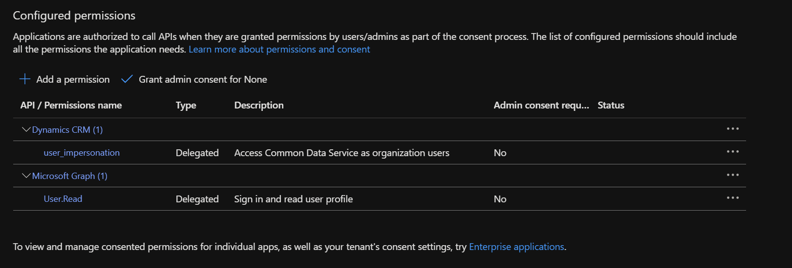
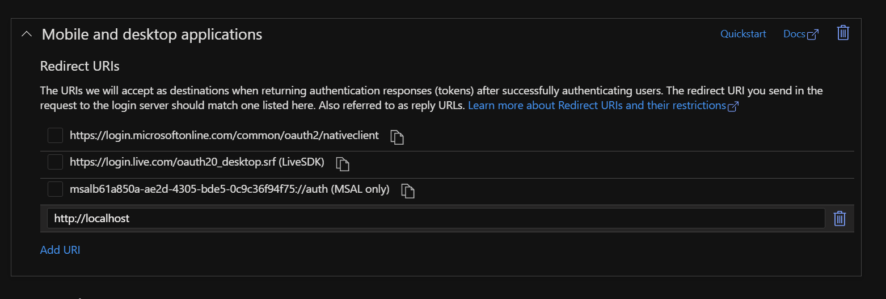
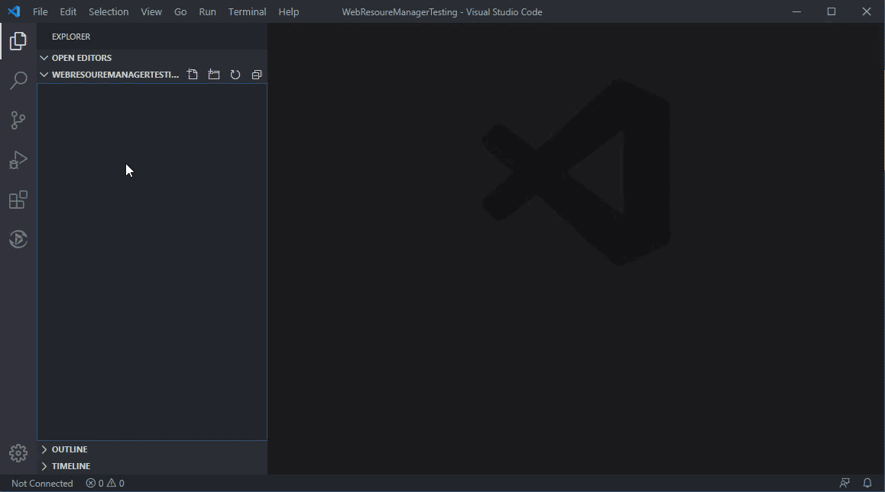
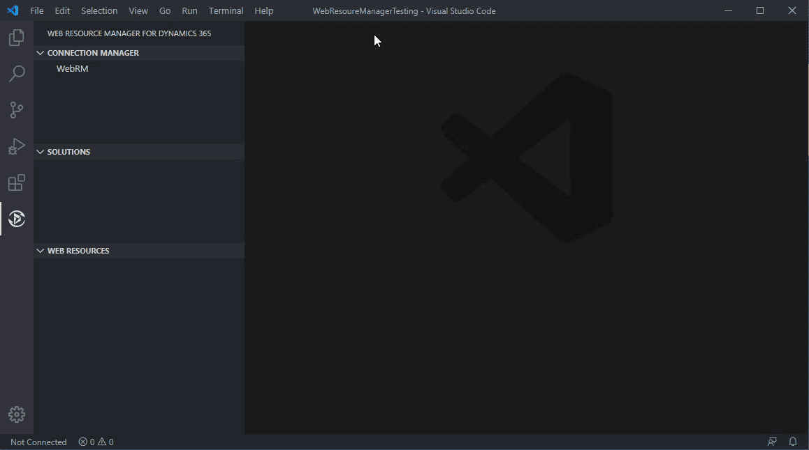
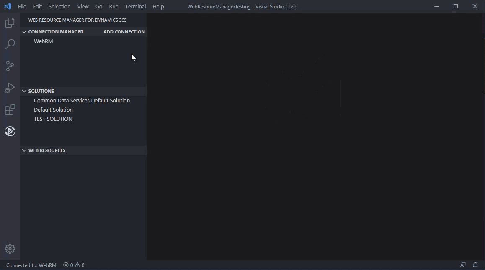
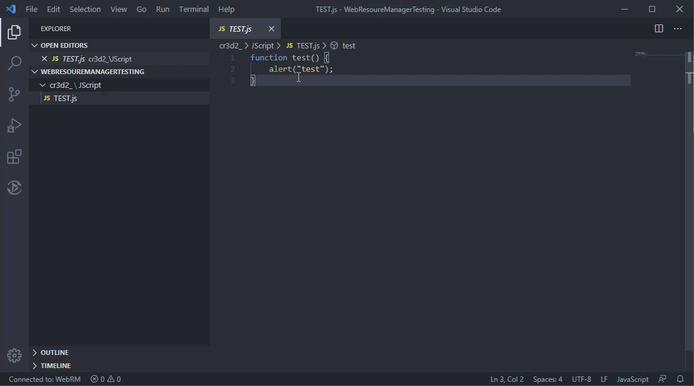

# vscode-webrm README

Dynamics 365 Web Resource Extension for Visual Studio Code.

## Features

This extension allows you to connect to Dynamics 365, modify, and publish various web resources directly from VS Code.

## Requirements

You must create an app registration that has impersonation rights for Dynamics CRM and User.Read for the Graph API.

## Extension Settings

This extension contributes the following settings:

- `webRM.appClientId`: (REQUIRED) Client Id of your registered app in Azure
- `webRM.appTenantId`: (REQUIRED FOR SINGLE TENANT APPS) Tenant Id of your registered app in Azure. Leave blank if Multi-Tenant
- `webRM.dynamicsAPIVersion`: (REQUIRED) API Version for Dynamics 365 Web API
- `webRM.solutionNameFilter`: Used to filter solution list retrieved from Dynamics
- `webRM.solutionSortAscending`: Used to change sort order of returned solution list

## Known Issues

## Limitations

Currently, this extension only works for Dynamics 365 Online. It has only been tested with version 9.0+.

## Release Notes

### 1.1.9
- Updated MSAL to `@azure/msal-node` 5.1.5 and raised the VS Code engine/runtime target for Node 20 support.
- Removed the `uuid` dependency and now use Node's built-in UUID generation.
- Added selected-solution tracking and a status bar indicator for the solution used when publishing.
- Publishing no longer requires opening a web resource from the extension first. The active file is matched to a server web resource by workspace-relative path.
- If the active file is not in the selected solution, the extension prompts to add it before publishing.
- If the active file does not exist on the server, the extension prompts to create it, add it to the selected solution, and publish it.
- Removed `webRM.pullLatestVersionFromServer`. Opening a web resource from the extension now always pulls the server version, while still warning when an existing local file differs from a server version modified by another user.
- Cleaned up duplicate Cancel buttons in publish confirmation dialogs.

### 1.1.8
- Added a new setting `webRM.pullLatestVersionFromServer` to control whether the latest version of a web resource is pulled from the CRM server when a file is opened.
- Added a warning that appears if the file on the server was last modified by a different user and the local content is different from the server content.

### 1.1.6
- Added better alerts for missing settings

### 1.1.5
- Removed obsolete connection info folder setting and related logic

### 1.1.4
- Major code cleanup: removed unused code and files
- Updated authentication logic and dependencies
- Added new configuration and utility modules
- Improved solution and web resource explorer features
- Enhanced connection management and settings UI

### 1.1.2
- Updated code for web resource retrieval.

### 1.1.0
- Added feature for adding and removing solutions as favorites by right clicking them.

### 1.0.1
- Initial release with updated authentication libraries.

## How to Use

### Config App Registration

Make sure user impersonation is checked when adding Dynamics 365 permissions.

Make sure http://localhost is added to redirect uri for "Desktop Application"

Don't forget to add the required configuration settings from your app registration to the VS Code extension settings.

### Add Connection

### Authenticate

### Download and Open Web Resource

### Publish Web Resource

Open the command palette (ctrl+shift+p) and select 'Dynamics: Publish Web Resource'

