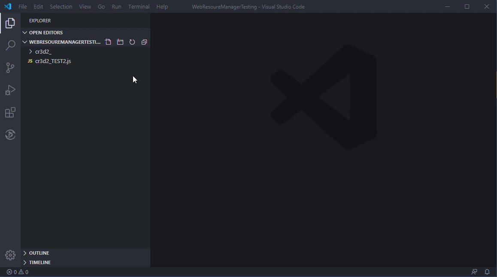

# vscode-webrm README

Dynamics 365 Web Resource Extension for Visual Studio Code.

## Features

This extensions allows for connecting to Dynamics 365 to modify and publish various web resources.

## Requirements

webRM.authWebServiceURL and webRM.dynamicsAPIVersion must be set in the Extension settings.

You can setup your own authentication web service using the code at the following url:
https://github.com/Sheeley7/vscode-webrm-auth

## Extension Settings

This extension contributes the following settings:

* `webRM.authWebServiceURL`: The URL of the Authentication Web Service.
* `webRM.dynamicsAPIVersion`: API Version for Dynamics 365 Web API

## Known Issues

## Limitations
Currently, this extension only works for Dynamics 365 Online. I have not tested with any other versions other than 9.0+

## Release Notes

### 0.0.1

Initial pre-release.

## How to Use

### Set Auth Server URL

### Add Connection

### Authenticate

### Download and Open Web Resource

### Publish Web Resource
