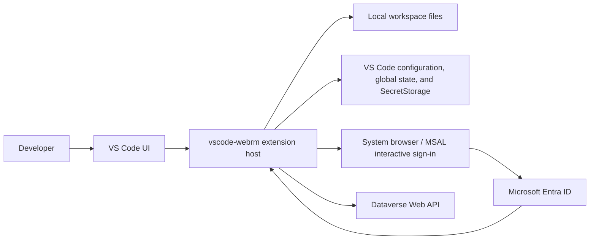
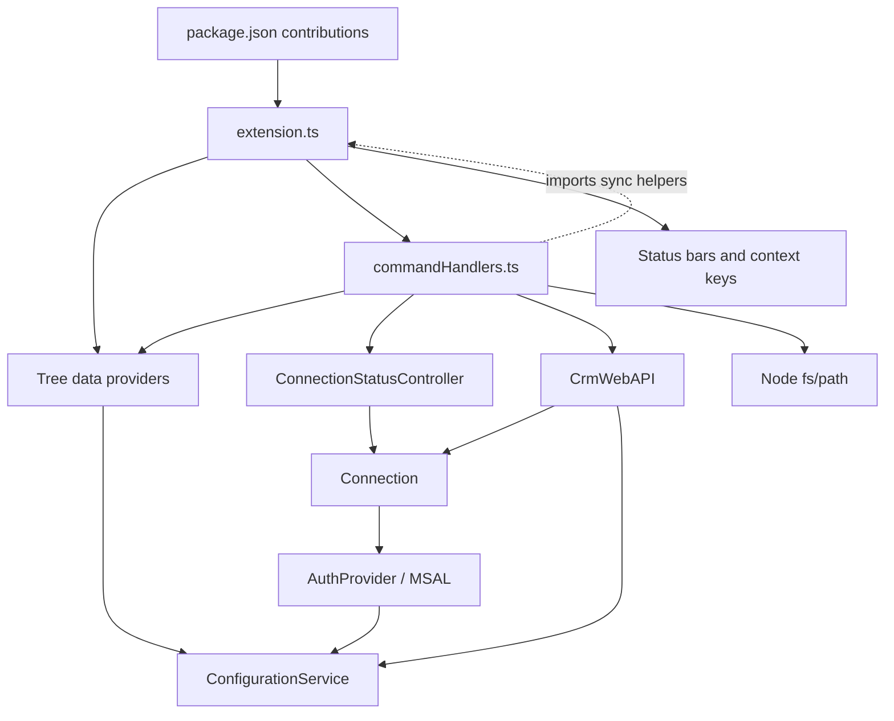

# vscode-webrm architecture

## Executive summary

`vscode-webrm` is a desktop VS Code extension for working with Microsoft Dataverse/Dynamics 365 web resources. It authenticates a user with MSAL, lists unmanaged Dataverse solutions, displays a selected solution's web resources as a virtual folder tree, maps those resources to files under a VS Code workspace, and supports single-file and solution-wide pull/push/publish workflows.

The implementation is a single Node.js extension-host process. There is no server-side component, database, background worker, or separate frontend application. VS Code contributes the shell (commands, tree views, editor integration, settings, notifications, and status bars); two small HTML webviews collect settings and connection details; the extension calls the Dataverse Web API directly with `node-fetch`.

At the time of this review, the package is version 1.1.9 and targets VS Code 1.98+ / Node 20. The source builds and passes strict TypeScript checking. The main architectural liabilities are the concentration of orchestration in `commandHandlers.ts`, duplicated and partially overlapping state, a circular module dependency, unsafe workspace-path construction from server-provided names, lack of OData pagination and optimistic concurrency, fragile custom batch parsing, and no automated tests. The configured lint command is also broken with the installed ESLint 9 toolchain.

## System context



Trust boundaries are crossed in three places:

- The webviews send connection and settings data into the extension host.
- MSAL opens the system browser and persists its token cache in VS Code SecretStorage.
- Logical web-resource names and base64 content arrive from Dataverse and are turned into local paths and files.

## Runtime and packaging

The extension entry point is `src/extension.ts`; `package.json` points VS Code to the bundled `dist/extension.js`. Activation is requested when the loading view opens or when any contributed `wrm.*` command runs.

The build is intentionally simple:

- TypeScript is configured for CommonJS, ES2020, and strict type checking.
- esbuild bundles `src/extension.ts` and all runtime dependencies for Node 20.
- Only the `vscode` module is external because VS Code provides it at runtime.
- Source maps are generated and minification is disabled.
- `.vscodeignore` excludes source, maps, development dependencies, documentation, and development configuration from the VSIX. The root-level `webviews/` and `resources/` directories remain available at runtime.

The repository does not track `dist/` or generated `.vsix` packages, although local copies are present in the reviewed workspace. A build is therefore required before packaging or launching the extension from its declared `main` entry.

## Repository map

| Area | Responsibility |
| --- | --- |
| `package.json` | Extension manifest: activation events, commands, views, menus, configuration schema, dependencies, and scripts. |
| `src/extension.ts` | Composition root, activation/deactivation, view registration, status bars, settings bootstrap, and in-memory file publish state. |
| `src/commandHandlers.ts` | All user workflow orchestration, confirmation dialogs, progress UI, filesystem I/O, and command registration. |
| `src/crmWebAPI.ts` | Dataverse OData/action client, record conversion, web-resource type mapping, batch request construction, and response parsing. |
| `src/auth/authProvider.ts` | Per-connection MSAL client, silent/interactive token acquisition, account selection, and SecretStorage cache persistence. |
| `src/auth/authTemplates.ts` | Browser completion pages shown by MSAL's interactive flow. |
| `src/connectionStatusController.ts` | Active connection, connection status bar, and local-path-to-Dataverse-ID lookup. |
| `src/configurationService.ts` | Typed access facade for `webRM.*` VS Code settings. |
| `src/utils/configUtils.ts` | Startup checks for required client ID and API version. |
| `src/views/connectionExplorer.ts` | Persisted connection tree and the `Connection` wrapper around `AuthProvider`. |
| `src/views/solutionExplorer.ts` | Solution tree, favorite sorting/persistence, and selected-solution state. |
| `src/views/webResourceExplorer.ts` | Converts a flat resource list into a sorted virtual folder tree. |
| `webviews/` | Inline-script forms for initial settings and new connection entry. |
| `resources/` | Activity-bar and marketplace artwork. |
| `.vscode/` | Extension-host launch, watch task, and editor recommendations. |

## Component relationships



`extension.ts` constructs one explorer instance of each type and one `ConnectionStatusController`, then injects them into `registerCommands`. This is straightforward manual dependency injection and keeps VS Code lifecycle ownership in the composition root.

There is one important exception: `commandHandlers.ts` imports hash/sync-state helpers back from `extension.ts`, while `extension.ts` imports `registerCommands`. This creates a circular dependency. The open-resource command additionally uses a dynamic `require('./extension')` for the same helpers. The current bundle builds, but initialization behavior is harder to reason about and the dynamic fallback can silently suppress sync-status failures.

## VS Code user interface

The activity-bar container has four views controlled by VS Code context keys:

| View | Provider | Purpose |
| --- | --- | --- |
| Loading | `LoadingTreeDataProvider` | Placeholder while `wrm.viewsReady` is false. |
| Connection Manager | `ConnectionExplorer` | Add, connect, copy URL, and remove environments. |
| Solutions | `SolutionExplorer` | List/filter/sort solutions, mark favorites, and link a solution. |
| Web Resources | `WebResourceExplorer` | Browse the linked solution's web resources and pull individual files. |

Three status-bar items expose the active environment, selected solution, and active file's in-memory publish status. The `wrm.connected`, `wrm.solutionLinked`, and `wrm.viewsReady` context keys control command/menu visibility; they are UI state, not an authorization or consistency boundary.

The extension registers 14 commands:

- Connection lifecycle: `addConnection`, `connect`, `removeConnection`, and `copyConnectionUrl`.
- Solution browsing: `getWebResources` (shown as “Link Solution”), `addFavoriteSolution`, `removeFavoriteSolution`, `filterSolutions`, and `toggleSolutionSortOrder`.
- File synchronization: `openWebResource`, `pullCurrentFileFromServer`, and `publishWebResource`.
- Solution synchronization: `pushSolutionLocalFiles` and `pullSolutionServerFiles`.

The settings and add-connection forms are webview panels. They use message passing to return form values to the extension. Their JavaScript and CSS are inline and their CSP permits `unsafe-inline`; no remote content is loaded.

## State model

State is spread across VS Code persistence and process memory:

| State | Storage | Lifetime / scope |
| --- | --- | --- |
| Connection name, URL, generated connection ID | `ExtensionContext.globalState["connections"]` | Persists across workspaces and sessions. |
| Favorite solution IDs | `ExtensionContext.globalState["favoriteSolutions"]` | Persists globally, not partitioned by connection. |
| Serialized MSAL cache | `ExtensionContext.secrets["<connectionId>_msalTokenCache"]` | Encrypted/OS-backed VS Code SecretStorage. |
| Client ID, tenant ID, API version | VS Code `webRM.*` configuration | Manifest declares resource scope; the startup form writes global values. |
| Solution filter and sort order | VS Code `webRM.*` configuration | Commands write workspace values. |
| Active connection and connected flag | `ConnectionStatusController` | In-memory until deactivation or disconnect. |
| Selected/linked solution | `SolutionExplorer` | In-memory and reset if the solution list no longer contains it. |
| Resource file path to Dataverse GUID | `ConnectionStatusController.webResourceLookup` | In-memory and reset when the connection changes. |
| File GUID, published flag, and optional SHA-256 hash | `extension.ts.fileSyncState` | In-memory and reset when the connection changes. |

The two resource maps overlap. `webResourceLookup` resolves a local file to a server record during publish, while `fileSyncState` drives the status bar. Neither survives an extension-host restart. This is acceptable for a cache, because publish can rediscover a resource by logical name, but the duplication makes state transitions easy to update inconsistently.

## Activation and configuration flow

1. Activation first sets all three context keys to false.
2. It creates status bars and explorer/controller instances.
3. It registers tree providers, selection listeners, all commands, and file listeners.
4. It sets `wrm.viewsReady` to true.
5. It checks for a client ID, an API version, and at least one open workspace folder.
6. Missing critical settings open `settingsForm.html`; saved values are written globally and checked again.
7. Missing workspace state stops the remainder of activation, although views and commands have already been registered.

The manifest defaults the API version to `9.1`, while `ConfigurationService` falls back to `9.2`. The manifest also declares the boolean `solutionSortAscending` default as the string `"true"`. These competing defaults should be normalized to one source of truth.

## Authentication and connection lifecycle

Each `Connection` owns an `AuthProvider` configured for the scope `<connectionURL>/.default`. If a tenant ID is configured, MSAL uses that tenant's authority; otherwise it uses MSAL's default authority behavior.

The login path is:

1. Lazily initialize `PublicClientApplication`.
2. Deserialize the per-connection MSAL cache from SecretStorage.
3. Select the first cached account, if any.
4. Attempt silent acquisition; fall back to `acquireTokenInteractive` and open the system browser.
5. Store the authentication result in memory and serialize the updated cache back to SecretStorage.

Connecting through the UI sets the active connection, authenticates, clears web-resource/file state, fetches visible unmanaged solutions, restores favorite flags, and updates the solution explorer. API helpers also call `connection.connect()` before every request, so token validation/acquisition is repeated at the boundary.

The deactivation routine disposes status bars and attempts to delete all MSAL caches. That cleanup appears ineffective because it looks for an exported extension `context`, but `activate` never exports one. Even if fixed, deleting persistent caches on every normal deactivation would conflict with the otherwise intentional silent-login design; cache deletion belongs in an explicit sign-out/remove-connection workflow.

## Dataverse API boundary

`CrmWebAPI` is a static service that builds URLs as:

`<connection URL>/api/data/v<configured version>/<query or action>`

All JSON requests include OData 4.0 headers and a bearer token. Its supported operations are:

| Operation | Dataverse endpoint/behavior |
| --- | --- |
| List solutions | Queries `solutions`, selecting ID/friendly/unique names; limits to visible unmanaged solutions and applies filter/sort settings. |
| List solution resources | Queries `msdyn_solutioncomponentsummaries` for component type 61. |
| Resolve by name | Queries `webresourceset` for an exact logical name. |
| Read content/details | Reads `content`, `modifiedon`, and expanded `modifiedby.fullname`. |
| Create resource | POSTs name, display name, inferred type, and base64 content to `webresourceset`. |
| Add to solution | Calls `AddSolutionComponent` with component type 61. |
| Update content | PATCHes `webresourceset(<id>)`, individually or in a custom multipart batch. |
| Publish | Calls `PublishXml` with one or more web-resource GUIDs. |

New resource types are inferred from the file extension. Supported mappings cover HTML, CSS, JavaScript, XML, PNG, JPEG, GIF, XAP, XSL/XSLT, ICO, SVG, and RESX. An unknown or extensionless file is rejected before creation.

The common request helper handles authentication, headers, JSON serialization, 204/PATCH responses, and Dataverse error-message extraction. Batch GET and PATCH requests use hand-built multipart bodies. Batch retrieval is chunked in groups of ten; bulk update currently sends all changed resources in one batch. Neither collection helper follows `@odata.nextLink`, so large solution/resource sets can be silently truncated at the server's page boundary.

## Workspace mapping and synchronization model

The central convention is:

`Dataverse logical name with '/' separators == path relative to a workspace folder`

For example, `new_/scripts/account.js` maps to `<workspace>/new_/scripts/account.js`. Server content is base64 encoded; local files are read/written as bytes for comparisons and transfer.

Most tree-based and bulk operations always use the first workspace folder. Active-editor publish/pull performs a more careful lookup of the workspace that contains the document. Consequently, multi-root workspaces have inconsistent semantics: an active file can map to a non-first root, while solution-wide operations only inspect the first root.

### Link a solution

Selecting “Link Solution” records the selected solution, fetches its component type 61 resources, converts the flat list into a virtual directory hierarchy, and enables solution-level toolbar commands. The tree is sorted with folders before files and alphabetically within each type.

### Pull/open one resource

1. Convert the selected resource's logical name to a local path and create parent directories.
2. Fetch server content and modifier metadata.
3. If a different local version exists, prompt before overwriting it.
4. Decode base64 to disk and open the file in VS Code.
5. Cache the file-to-GUID link and its current hash as published.

“Pull Current File” performs the inverse lookup from the active editor's workspace-relative path, resolves the resource by name, confirms any overwrite, writes the server content, and updates the caches.

### Publish one resource

1. Require an active editor, save dirty changes with user confirmation, and derive the logical name from the workspace-relative path.
2. Require an active connection and selected solution, then read and base64-encode the file.
3. Resolve the server GUID from the in-memory lookup or by exact resource name.
4. If the record does not exist, ask to create it, infer its type, add it to the selected solution, and publish it.
5. If it exists, warn when another user last modified it and check whether it belongs to the selected solution.
6. If needed, ask to add the resource to that solution.
7. PATCH the content, call `PublishXml`, then cache the GUID and SHA-256 hash as published.

The “modified by another user” check is advisory only. There is no ETag/`If-Match` check between the read and write, so a concurrent server update can still be overwritten after the confirmation.

### Push a linked solution

1. Fetch all resources in the linked solution and retrieve server details in GET batches of ten.
2. For each resource that has a local file under the first workspace root, compare local and server base64 content.
3. Confirm the count of changed resources.
4. PATCH all candidates through one non-transactional batch request.
5. Publish all changed IDs with one `PublishXml` action and update in-memory sync state.

Local files that are not already members of the linked solution are ignored; this workflow does not create or add resources. Cancellation cannot abort an in-flight HTTP call, and cancellation after the PATCH batch but before `PublishXml` can leave server content updated but unpublished.

### Pull a linked solution

1. Fetch the linked solution's resources and server details.
2. Compare each server payload with its local file, treating a missing file as different.
3. Confirm the number of files to replace/create.
4. Write each base64 payload under the first workspace root and update in-memory sync state.

This is a replacement operation, not a merge. Local files that are not in the selected solution are untouched.

## Error handling and observability

Command handlers generally catch failures at the workflow boundary and show a VS Code error message. Lower layers add context and rethrow. Long-running operations use notification progress, and destructive overwrites/remote updates require modal confirmation.

There is no dedicated output channel or structured logger. Diagnostics are split between user notifications and `console.log`/`console.error`, even though the authentication error page tells users to consult a “Web Resource Manager” output channel that is not created. Cancellation tokens are polled between steps but are not passed to filesystem or HTTP operations.

## Architecture assessment

### What is working well

- The extension has a small deployment footprint and no service to host or operate.
- Authentication tokens are stored in SecretStorage rather than settings or global state.
- Dataverse access is centralized behind one API class, and UI tree providers have focused responsibilities.
- Destructive local overwrites and remote publishing require explicit confirmation.
- Resource discovery by workspace-relative path means publishing no longer depends on opening a file through the explorer first.
- Bulk workflows compare content before writing and consolidate publishing into one action.
- Strict TypeScript checking and a single reproducible esbuild entry point provide a sound build baseline.

### Priority findings

| Priority | Finding | Impact | Recommended direction |
| --- | --- | --- | --- |
| High | Server-provided web-resource names are joined to the workspace path without rejecting `..`, rooted paths, or confirming final containment. | A malicious or malformed logical name could read/write outside the intended workspace during pull or bulk sync. | Normalize and validate every logical name in one `WorkspaceMapper`; reject traversal/absolute paths and verify the resolved path remains under the chosen workspace root. |
| High | No OData pagination is implemented. | Solutions or resources beyond the first Dataverse page are invisible and omitted from bulk operations. | Follow `@odata.nextLink` until exhausted, with cancellation and a sensible safety limit. |
| High | There are no automated tests for path mapping, tree construction, API queries/batches, or publish decisions. | Regressions in destructive sync paths can reach users undetected. | Add unit tests around pure mapping/parsing logic, mocked API tests, and a small extension-host smoke suite. |
| High | Remote updates have no optimistic concurrency; bulk push does not perform the single-file modifier warning. | Concurrent changes can be overwritten between comparison and PATCH. | Capture ETags and use `If-Match`; present a consolidated conflict list before bulk updates. |
| Medium | `commandHandlers.ts` (1,262 lines) owns commands, dialogs, filesystem work, mapping, synchronization policy, and transaction ordering. | Changes are difficult to isolate and test; duplicated single/bulk behavior can drift. | Split into connection, solution, single-file sync, and bulk sync services/command modules. |
| Medium | `extension.ts` and `commandHandlers.ts` form a circular dependency; one path uses a silent dynamic `require`. | Initialization and bundling behavior are brittle, and status updates can fail without visibility. | Move file sync state/hash logic into an injected `FileSyncStateService`. |
| Medium | Active connection, linked solution, GUID lookup, and file publish state live in separate mutable stores. Bulk operations omit hashes when marking files published. | UI status can be stale or inconsistent, especially after save/restart and for binary resources. | Define one session-state model and explicit state transitions; hash bytes, not UTF-8 text, and persist only if status must survive restart. |
| Medium | Multi-root behavior is inconsistent because most operations use `workspaceFolders[0]`. | Bulk sync may operate on a different root than active-file publish. | Bind a linked solution to a specific `WorkspaceFolder`, show it in status, and use it for every mapping. |
| Medium | OData filters are assembled by interpolation; `solutionNameFilter` is neither escaped nor URL encoded. | Apostrophes can break requests and arbitrary query syntax can be injected into the URL. | Escape literals consistently and construct query parameters with URL encoding. |
| Medium | Custom multipart creation/parsing assumes response ordering and a boundary prefix matching `batchresponse_`; updates are not chunked. | Batch behavior is sensitive to response formatting and large pushes may exceed service limits. | Use a tested OData batch utility or robust MIME parser, associate responses by content ID, and chunk both reads and writes. |
| Medium | The ESLint 9 dependency is paired with legacy `.eslintrc.json`. | `npm run lint` fails before examining source. | Migrate to `eslint.config.js` or temporarily pin ESLint 8. |
| Low | Deactivation cache cleanup depends on a context export that does not exist and conflicts with persistent sign-in. | Intended cleanup does not occur; fixing it literally would log users out on ordinary shutdown. | Remove deactivation deletion; explicitly delete a connection's secret when removing/signing out. |
| Low | Settings defaults/scopes are inconsistent (`9.1` vs `9.2`, string vs boolean default, global form writes vs resource schema). | Behavior can vary by how a setting was populated. | Make manifest defaults authoritative and use a consistent configuration target. |
| Low | Webviews allow inline scripts and use broadly typed message payloads. | This weakens defense in depth and input validation. | Use CSP nonces, narrow local roots, and validate/normalize messages in the extension host. |
| Low | Some dead or stale code remains (`getAuthWebServiceURL`, token expiration buffer, unused controller methods/imports, obsolete comments). | It obscures the actual lifecycle and creates misleading maintenance signals. | Remove unused paths after test coverage is in place. |

## Recommended target structure

The current single-process architecture is appropriate; it does not need microservices or an external backend. The useful evolution is internal separation around testable boundaries:

```text
src/
  extension.ts                 # composition and VS Code lifecycle only
  commands/
    connectionCommands.ts
    solutionCommands.ts
    fileSyncCommands.ts
    solutionSyncCommands.ts
  dataverse/
    client.ts                  # HTTP/authenticated request boundary
    solutions.ts
    webResources.ts
    batch.ts
    types.ts
  auth/
    authProvider.ts
  workspace/
    workspaceMapper.ts         # safe logical-name/path conversion
    contentStore.ts            # byte reads/writes and hashes
  state/
    sessionState.ts            # active connection/solution/file state
    persistentState.ts         # globalState and SecretStorage access
  views/
    ...
```

Suggested dependency direction:

`extension/UI -> command services -> workspace + Dataverse services -> HTTP/auth/configuration`

Lower layers should not import `extension.ts` or concrete tree providers. Commands should return explicit results that the UI layer uses to refresh views, status bars, and context keys.

## Verification performed for this review

- `npm run build`: passed; esbuild produced the Node 20 extension bundle.
- `npx tsc --noEmit`: passed with strict TypeScript settings.
- `npm run lint`: failed before linting because ESLint 9 does not load the legacy `.eslintrc.json` format by default.
- Test discovery: no test/spec source files or test script were found. `.vscode/launch.json` still contains a template “Extension Tests” configuration pointing at a nonexistent `out/test/suite/index`.

This document describes the repository as reviewed on 2026-07-22 at commit `796e112` (version 1.1.9).
